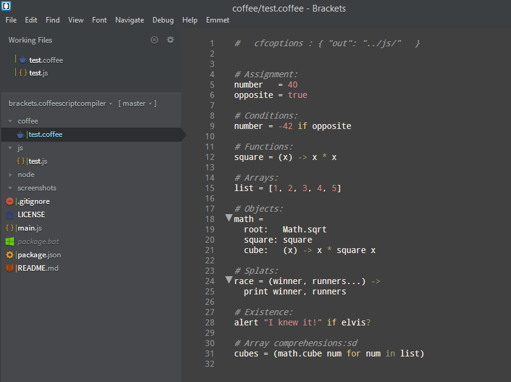
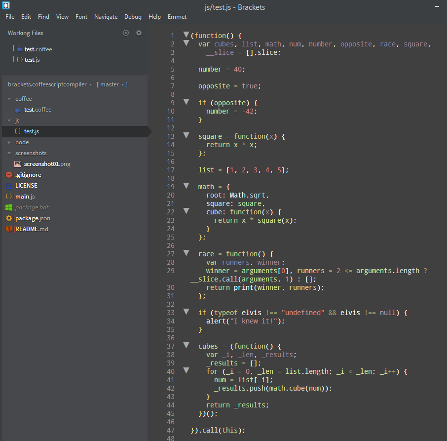

Brackets CoffeeScript Auto Compiler
=======================

Another extension from Technet which compiles CoffeeScript files (files with `.coffee` extension) and generate Javascript file automatically when file(s) are modified and saved.

> This will use [CoffeeScript version 1.8.0](http://coffeescript.org/) - [https://github.com/jashkenas/coffeescript](https://github.com/jashkenas/coffeescript)

_CoffeeScript file_

_Compiled Javascript file_

#### Usage

Just create CoffeeScript files as usual with the extension of `.coffee` and this extension will monitor any modifications of those files and output compiled Javascript file when you save the original file. By defult javascript file be created at the same location with same name with `.js` extension. If you want to output the file into different location use the comment hint as follows. This should be at top of the file before any non empty line. (Didn't want to parse entire file looking for this option as it is unnecessary). `out` path is always relative to CoffeeScript file.

__Ex 1 (store in one level above)__

    #   cfcoptions : { "out": "../js/"   }    
    
This will generate the javascript file in `js` folder which according to following folder structure.

    project-folder    
        |---coffee
        |   |---test.coffee
        |---js
            |---test.js

__Ex 2 (store in same folder with different name)__

    #   cfcoptions : { "out": "test2.js"   }
    
This will generate the javascript file in `js` folder which according to following folder structure.

    project-folder    
        |---coffee
            |---test.coffee
            |---test2.js

__Ex 3 (store in sub folder)__

    #   cfcoptions : { "out": "js/test2.js"   }
    
This will generate the javascript file in `js` folder which according to following folder structure.

    project-folder    
        |---coffee
            |---test.coffee
            |---js
                |---test2.js

___Note: This will not create folders if they are not exist. So before you save and generate make sure you have the correct folder structure.___

#### Future Improvements

* Automatically create folder structure if not exists.
* Use folder level configuration file in addition to file level comment for compile option which applies to all files in that folder.
* Support other CoffeeScript compile options.

#### Version History

##### 0.1.0

Initial release with basic functionality.
